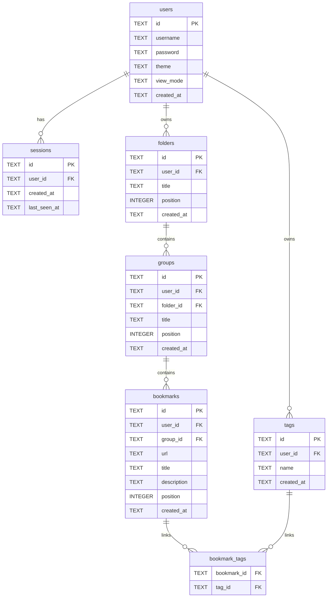

# Database

The application uses a SQLite database file on the server.

## ERD

## Ordering

- `folders.position` orders folders per user.
- `groups.position` orders groups per folder.
- `bookmarks.position` orders bookmarks per group.
